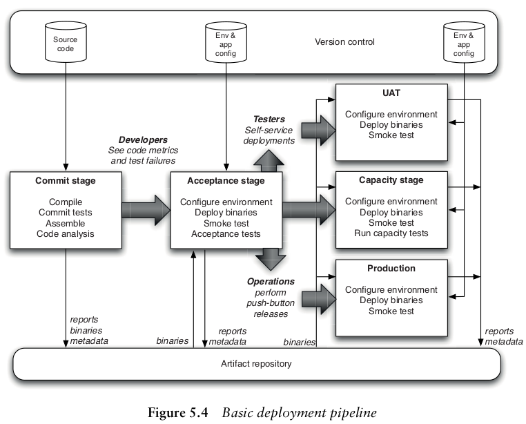
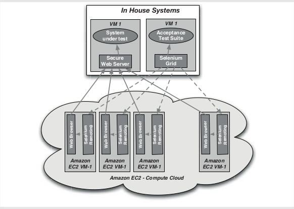
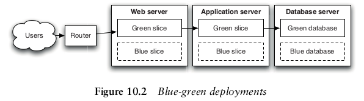
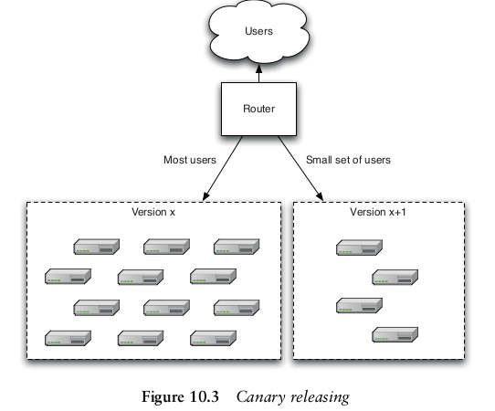
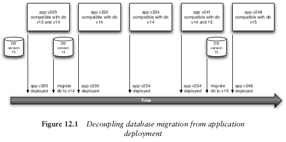
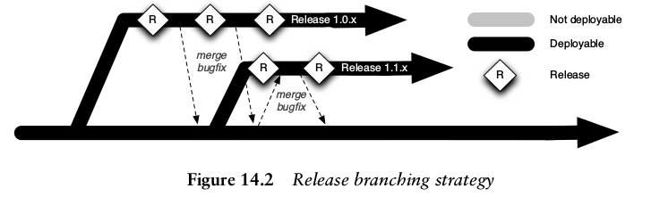
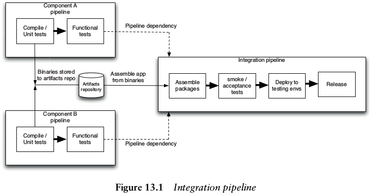
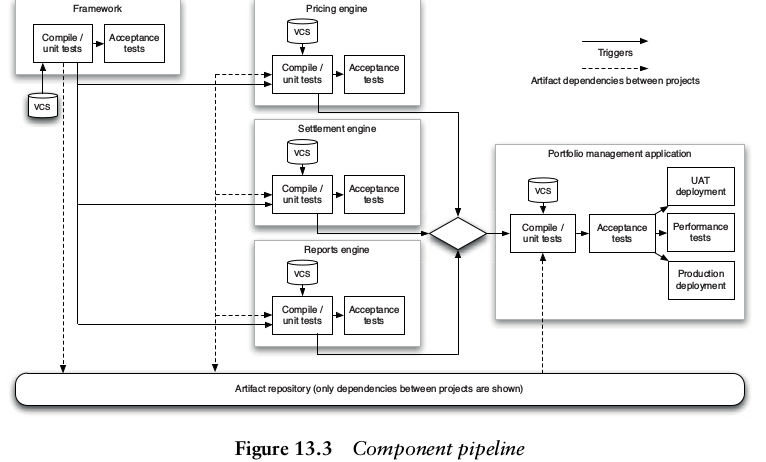
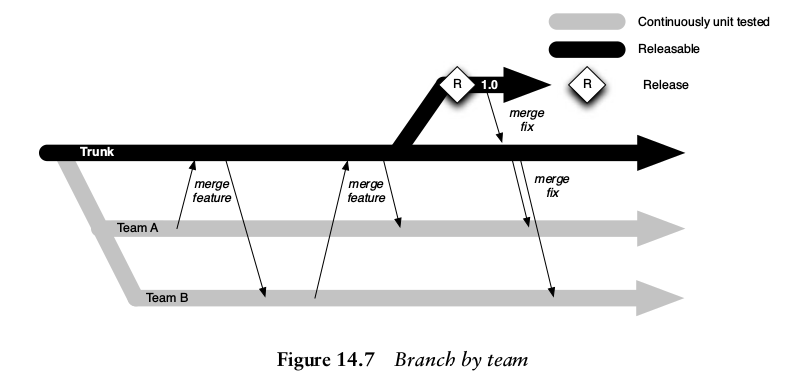
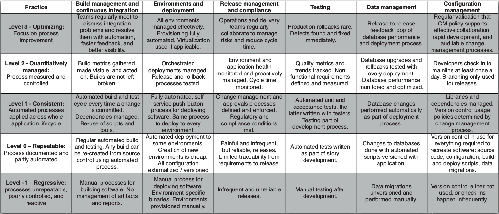

Continuous Delivery
###################

.. sidebar:: Meta

 :Optimization: Fine
 :Last Review: Sat Nov 5
 :Importance: High
 :Updated: |today|

 :Authors: Jez Humble and David Farley

.. contents::
 :depth: 5

...............................................................................

Configuration Management
************************

Isolate dev env from prod with firewall.

Good CM Strategy:
  * Able to reproduce any env (test,prod) including version of application, OS,
    patches, network configuration.
  * Ability to easily make incremental change in any of those items in any env.
  * Log & trace each changes made in any item.
  * Should be easy for others to inspect, make changes.

Application Configuration
=========================

Ideally application should generate default configuration catalog on build
time.

Configuration management principles:
  * Consider where is the best time to inject configs (build, package or run).
  * Keep available configuration parameter with the application source, but
    store actual values somewhere else. Values have independent life-cycle.
  * Configuration value change should be automatic from repo (pulling, setting,
    notifying application).
  * Configuration management system should be able to separate configs by
    application name, version and environment.
  * DRY (don't repeat yourself) by creating one configuration parameter
    representation for each concept.
  * Keep configuration parameters simple and focused.
  * Test configuration values (reachability, and smoke tests).
  * Never store password in repo, they should be manually entered.

Reading Config from URL
-----------------------

You pass application name, env, version in GET parameter and URL return config
in known format.

Good Web Configuration app should have:
  * Able to add new env and ability to define new set of config values for each
    env.
  * New version of config with changed set of config values.
  * Configuration values hierarchy, overloading.

Configuration changes should be tested. Check service when changed URL or
IP/Port setting. Smoke test application with functional tests depending on
config parameter.

Continuous Integration
**********************

CI requires
===========

#. Application artifacts, code, tests, database scripts, build and deploy
   scripts, everything needed to create, install, run and test application
   should be in a single repo.
#. Ability to build, test, and deploy application automatically with scripts
   from the command line.  Developer should be able to do the same tests what
   CI system does (including smoke tests). Build script should be treated like
   codebase meaning tested, etc.
#. Devs team should agree to do small incremental changes, check in frequently
   and at first fix changes which broke the app.

Keep the build and test time short otherwise, developers will not commit often,
or build/test locally before push.

Libraries for the application should be managed automatically(Maven, Ivy) or
for small projects they can be included in the repo.

CI Reports can be fun (lamp reporting build status, text-to-speech etc).
Reports should contain number of failed test, ignored, passed etc.

Some CI systems offer *personal build* or pre-push CI for developers (Pulse,
TeamCity) which allows you to run test without pushing to the central repo.

CI For Developers
=================

Process:
  #. When you finished certain task, and unit test/build was successful.
  #. Check if build is already running. If yes wait till it finishes.
  #. After build finishes successfully, pull changes.
  #. Run test/build scripts again to make sure they works with pulled changes.
  #. Push changes to the repo.
  #. Wait the build status from CI server.
  #. If it fails fix the issue at first before started another task.

Rules:
  * Never check in on broken build.
  * Never leave broken build and go home (some doesn't even push when 1 working
    hour left to go home).
  * Broken commit should be fixed within 10 Mins or reverted to last working
    commit.
  * After those rules, developers may start commenting tests to keep green
    light. Usually developers should fix the failing test, delete it or fix the
    code.
  * Fix others tests which your commit broke as you caused regression.
  * For CI quality unit tests are essential and TDD can be requested.

Test Types
===========

* Unit Test
    * Should finish at max in 10 min, but try to limit up to 5 min.
    * Shouldn't require app to be running.
    * Should not involve calling DB, filesystem, API or other services
      directly.

* Acceptance Test
    * Should answer devs question: "How do I know when I'm done".
    * Should answer user question: "Did I get what I wanted".

* Components test (Integration Testing)
    * Ensure that each independent part of your application works correctly
      with the services it depends on.
    * Normally when you depend on service which is not under you control, you
      create 2 types of tests. Tests with Mocks and hitting production-like
      instances.

* Manual Tests
    * Tester offers application improvement after real-usage (User Experience)
    * After each iteration it's a good idea to showcase new features to
      end-user to detect changes in requirements asap.

* Deployment Tests
    * Check if deployment worked (correctly installed, configured, integrated)

Pipeline Stages
***************

Implementing Pipeline
=====================

#. Model Value Stream and Walking Skeleton (from development to release):
    .. image:: images/value-stream.png

    * Value stream defines wait time and actual working time required for each
      step.
    * Talk to people involved withing this project to draw a map with estimate
      times. If it's a new project you can compare to already existing one in
      organization.
    * Model this process in CI. Create basic minimum stages which can simply
      return *true* for skeleton.
    * Make automatic build/deployment stages.
#. Automate unit test and code analyzes:
    * Add unit tests check and code analyses reports.
    * Later we can add components test and after it takes more than 5 min, we
      can split the tests and execute in parallel.
#. Automate acceptance tests:
    * Add functional and non-functional tests.
#. Evolve pipeline:
    * Monitor constraints, improve.
    * Big projects can have pipeline for each component, and one pipeline which
      collects all components together and run acceptance tests.

Commit Stage
============

The idea is to detect, as fast as possible, the most common failures that
changes to the system may introduce and notify the developers so they can fix
the problems quickly.

Steps:
  #. Compile code
  #. Executes commit tests (starting by unit test only, later add usually
     failed tests from acceptance).
  #. Create binaries/installer and store artifacts in artifact repo (not in
     VCS).
     If CI doesn't have artifact repo included, check Nexus or Artifactory.
  #. Perform code analysis: coverage, code duplication, compilation warnings,
     coding standards, cyclomatic complexity.
  #. Report if commit crosses unit test acceptable time.
  #. Application specific reports such as DB schema graph.
  #. Prepare test artifacts for acceptance tests (test db, etc).

*Preflight build* or *Pretested commit* in CI runs test before devs commit.

Unit Test
---------

Unit test coverage of 80% is acceptable and we assume ok on coverage test.
It doesn't interact with db or filesystem or other components, but we use stubs
for testings or in memory databases.

*Stub* is to create minimal implementation of objects required to test the
function and assert.

*Mocking* is when compiler builds stub to test for us (Jmock, Rhino, Mocha
etc).

If test depends on time like cron execution, fake time in unit tests, don't
rely on real system time.

Build
-----

Build Binary Once:
  #. Helps keep pipeline efficient by removing build time on each env.
  #. Recompiling in every step may cause different binaries cos of compiler
     version etc. And the binary we test might not match to the on we deploy in
     production.
  #. Forces us to separate config from the app.

Product-Orient Build Tools (Make, Rake) runs task in defined order however it
check output of previous task timestamp to be later than current task output
file timestamp. Known as incremental build and helps to run task whose
dependent outputs were updated since the last build.

Task Orient Build Tool (Ant, MsBuild) runs tasks after it's dependents and runs
each task only once.

Build Scripts Principles:
  #. You can start with 1 script for all pipeline stages, later split it (
     commit stage script, acceptance etc )
  #. Developers should use the same deploy/build/test scripts as CI does.
  #. Use OS Packaging to install built application. Makes easier to upload
     files and manage versions. (RPM, DPKG). For complex project, hybrid
     approach such as install packages to place all files where necessary, and
     than run specific tools required to finish application deploy.

Example Maven Build Structure

::

  /project_name
    README.md
    /src
      /main
        /[java,scala]
        /config
        /resources
        /...
      /test
        /java
        /resouces
        /...
      /doc
    /lib
      /runtime
      /test
      /build
    /target (gitignored, bins)

Acceptance Tests
================

Functional
----------

.. glossary::

  *Happy Path*
      single canonical path for the story (given-when-then)

  *Alternate Path*
      variation in the story path

  *Sad Path*
      path causes error condition

Business analysts, testes and developers gather to define acceptance criteria,
and test cases.

Dev and Testers should collaborate from start to the end. At first everyone
should agree on a "happy path" where testers make test and devs code.  When
developer finishes some functionality, it should ask tester to verify. To avoid
delays on communication.

Use domain language for test rather than direct API, UI checks to avoid test
failures on small changes.

Test Creation Steps:
  #. Discuss acceptance criteria for your story with your customer (based on
     INVEST principles)
  #. Write them down in the executable format (see example below).
  #. Write an implementation for the test which uses only the domain language,
     accessing the application driver layer.
  #. Create an application driver layer which talks to the system under test.

Behavior-driven: acceptance criteria should be written in the form of the
customer's expectations.

Acceptance Test DSL:
::

  **Given** some initial context,
  **When** an event occurs,
  **Then** there are some outcomes.

::

  Feature: Placing an order
  Scenario: User order should debit account correctly
    Given there is an instrument called bond
    And there is a user called Dave with 50 dollars in his account
    When I log in as Dave
    And I select the instrument bond
    And I place an order to buy 4 at 10 dollars each
    And the order is successful
    Then I have 10 dollars left in my account

.. sourcecode:: ruby

   #Cucember Example
   Before do
       @admin_api = AdminApi.new
       @trading_ui = TradingUi.new
   end
   Given /^there is an instrument called (\w+)$/ do |instrument|
       @admin_api.create_instrument(instrument)
   end
   Given /^there is a user called (\w+) with (\w+) dollars in his account$/
       do |user, amount|
       @admin_api.create_user(user, amount)
   end
   When /^I log in as (\w+)$/ do |user|
       @trading_ui.login(user)
   end

On a mid Project start automating happy path testing at first with as wide
coverage as possible.

Test implementation uses application driver calls to interact.
Application driver understands how to interact with GUI.
By separating test and application driver, when GUI changes we only need to
change driver for changes, and all tests will pass again
For e.g: create userCreate function in application driver, than all tests
testing user interaction will create new user, not sharing any resources and
executed in parallel.

Try to build state which is required for tests such as database to work with
minimal configuration required and maintain, don't just dump production db.
Be **very** defensive for test where starting state can't be guaranteed and
it doesn't clean up after test is executed (before test check all conditions
for the test).

Create Atomic test so they can run in any order and in parallel.  Test creates
all it needs and then cleans everything leaving no trace but reports (this can
be done by db rollback for example after test).

Avoid creating test-only code/interfaces in application.

Acceptance test often can be asynchronous meaning it should wait for background
job to assert like wait for Email received.  Example of test with optimized
waiting instead of simply waiting for long period of time:

.. sourcecode:: csharp

      private void ConfirmEmailWasReceived() {
      TimeStamp testStart = TimeStamp.NOW;
      do {
          if (EmailFound()) {
             return;
          }
          Wait(SMALL_PAUSE);
      } while (TimeStamp.NOW < testStart + DELAY_PERIOD);
          Fail("No email was found in a sensible time");
      }

Auto acceptance test should use test doubles(one driver per external system)
for external systems rather then reaching real systems.
This gives 2 benefits:

  #. You can control external system initial state.
  #. Simulate external system error, failure etc.

User acceptance test however might require real external system integration and
production like env.

When testing external systems to make sure it behaves as expected, write test
for obvious failures and later add as you discover more.  Those test probably
can't be run on each acceptance test, as it will load external system. We can
create a new nightly stage or run them on capacity stage for e.g.

Acceptance test may include several commit, we should be able to determine new
commits in CI test.

We deploy app with the same script in prod like env for acceptance test, and
fail whole test if smoke test of these deployment fails.

Use compute grid to speed up acceptance test on multiple platforms:

To speed up acceptance tests:
 #. Find common patterns and optimizing (like pre populated seed data,
    instead of all test creating them).
 #. Application may have API and UI for the same feature, test API first and
    fail test if it's not ok.
 #. If possible split test in batches and run in parallel.

.. seealso::
 * Lisa Crispin and Janet Gregory’s Agile Testing (Addison-Wesley, 2009)

Non-Functional
--------------

.. glossary::

  *performance*
      time single transaction takes.

  *throughput*
      how many transaction on a given period.

  *capacity*
      maximum transaction with acceptable performance.

Measurements that can be performed:

* **Scalability** - with more servers/threads deployed, how does the response
  time of single requests and simultaneous users change.
* **Longevity** - does the performance change after a certain period of time?
  Detects memory leaks.
* **Throughput** - How many transactions, messages, page hits per second can
  the system handle?
* **Load** - What happens to capacity when the load increases to
  production-like proportions and beyond?

Isolate capacity testing env to avoid network or other process impacts on
results (otherwise we might get false-negative results due to other process
activity). Env should be production like including hardware, OS etc. If
hardware is different in extreme case you can benchmark both env hardware and
create scaling factor.

Should be a whole separate stage and run in parallel to manual
test, integration test etc.

Usually runs less frequently than acceptance, and critical spots can be
included in special cases to commit test.

Mostly statements defined for capacity tests are too general like: *"All user
interaction will take less than 2 seconds"* or *"The system will process 80000
transaction per hour."* -  problems: In all circumstances?  What if we work
from DR? Even very rare interactions?

Recommended to benchmark on stub at first, to make sure test handles required
throughput.

Besides reporting success or failure, we can generate graphs for capacity
change measurements.

To balance between over-complex code which copes non-existing capacity issues
and between assumption you will fix all capacity issues later:

  #. Decide app architecture (pay attention to IO boundaries: CPU, Disk etc).
  #. Understand patterns/anti-patterns that affect stability/capacity.
  #. Keep team working within the architecture and encourage clarity and
     simplicity in code unless explicit test demonstrates capacity issue. If
     there is no clear issue, prefer cleaner and simpler code to complex one.
  #. Avoid threading, single thread app perform best, locking threads are cause
     for most failures.
  #. Pay attention to data structures and algorithms.
  #. Use automatic tests to assert desired capacity level.
  #. Use profiling for focused fixes on problems identified by tests.
  #. Use existing production system for capacity measurement.

Benchmark test such as interaction per second database handles are academic,
and useful for optimizing specific area of system or choosing technology.
Business side capacity test are needed separately such as:

  * How many sales per-second it handles on regular usage pattern?
  * Can predicted user-base work on peak loads?

General strategy is to record acceptance test scenario path, post-process to
scale up and replay them.
Scenario-based capacity testing is helpful also to:

  * Reproduce complex production defect.
  * Detect memory leaks and garbage collection impact.
  * Simulated different scenarios etc.

Set test acceptance value to minimum acceptable value and tune them later
times. This helps you catch commits which introduce slower response.
You should consider other load application has in production and calculate
acceptable thresholds based on that.

Avoid direct UI calls for capacity testing, most of the time, we don't need to
test button click etc from UI which is later a single interaction to API.  It's
better to record API calls and test them. If UI is thick and needs testing,
test it separately to stubbed backend, and backend separately.

If we test API, we can clone acceptance test path, run it and save replay to
disk and create templates to replace unique variables such as ORDER_NUMBER (try
to use as few variables as possible). We can than provide success criteria and
test data to fill template to run capacity tests. This approach makes easy to
record new capacity tests.

Manual Testing
==============

Checks if acceptance test results are valid, or how app looks in different
platforms and so on.

Deploy
======

To avoid failures on release:
  * Release plan should be maintained by everyone: devs, testers, ops, support.
  * Mitigate human errors by automating everything starting from the most
    error-prone stages.
  * Rehearse in staging env.
  * Be able to back-out the release.
  * Strategy for data/configurations migration for update and rollback.

Deploy the same way in all env.

Staging env should look like production as much as possible:
  * Same network topology, firewall config etc.
  * Operating system including patches.
  * Application stack installed.
  * Application data for migration testings.

We can use Configuration file for each env and we can distinguish env by
machine hostname or OS env variable.

Generally we don't want automatic deployment, but easy interface for tester to
choose release candidate (with status if test worked, and commit message) and
deploy to his env.

Deploy by layers and test before going further:

+-------------+--------------------+
| Application | Application Config |
+-------------+--------------------+
| Middleware  | Middleware config  |
+-------------+--------------------+
| OS          | OS config          |
+-------------+--------------------+
|  Hardware   |                    |
+-------------+--------------------+

After deployment smoke test the application and services it depends (db, api,
messaging etc) such as by retrieving a record, or confirm we can contact
website, or send pings to test firewalls rules.

Deployment script Tips & Tricks:
  #. Always use relative paths with some strict exceptions e.g: library
     should be places in certain dir.
  #. The third time you do same thing, it should be automatic.
  #. Store exact revision information into binary metadata for traceability or
     do MD5 hash on binary and save it in Db with revision information.
  #. Binaries are stored in shared filesystem, never in VCS.
  #. If unit test failed don't stop the build, finish other tests and generate
     better report and than fail the build/deploy step (fail when you can't
     continue duo to error like compilation)

Release
*******

At the beginning of the project, stakeholders should gather and agree on
*release strategy (pre-defined steps available in book)*.

All successful build should be promoted, meaning it should be visible for
stakeholders to view new version and deploy in any env they would like.

Run every emergency fix through your standard deployment pipeline.

Release Rollback
================

2 constraints on rollbacks while releasing:
  * Database needs migration as any shared resources between envs (sessions,
    cookies, etc).
  * Application update which requires more than 1 server change or orchestrated
    release.

To cope with those constraints, you should backup production state database,
filesystem etc and test those backups restoration before releasing new
version.

Rollback plan can also be to redeploy whole env with a good working state
config:

  * Pros: known fixed time it takes to deploy whole env, tested many times.
  * Cons: non-zero downtime, overwrites old version, if database is restored
    from backup new records gets lost

Zero-Downtime Release
=====================

Or Hot-Deployment: Instant users switch to new version and instant rollback.
Key is to decouple parts of application so that we can run new version of
database, service, static resource standalone before updating whole app:

  * EC2 API uses version in URL and runs multiple version of the API:
    ``ec2.amazonaws.com/doc/2009-11-30/AmazonEC2.wsdl``

Blue-Green Deployment
=====================

We deploy new version in Blue env, smoke test, let it warm up and than switch.

Database is still an issue, before we switch we have to migrate Green db to
Blue:

  * One way is to lock Green on write, move data to Blue, check if it runs ok,
    switch and enable write on blue.
    If issue happened before enabling write mode, it's safe to revert.
    If issue happened after enabling write on Blue, we should have a plan how
    to migrate new records to Green db when doing rollback.
  * Another option is to design app so that we can migrate the database
    independently of the upgrade process.

Some may have several production env for keeping different versions of the app
but try to keep at max 2 as support and maintenance gets harder with more envs.

Canary Release
==============

Deploy new version and route some users to new version:
  * pros: easy roll-back, generates new features business analytics, capacity
    tests.
  * cons: shared resources such as session, database etc should be aware of
    both versions.

Works best with Shared-nothing architecture.

.. seealso::
   * https://developers.google.com/protocol-buffers/
   * Configuration Management Best Practices

Monitoring
**********

* Hardware (fan, temperature etc).
* Operating System (process table, IO, memory, CPU etc).
* Middleware (Connection pool, thread pool, response time etc).
* Application: should be written so that it provide hooks to monitor operation
  and business data (number of transaction, their values, connection status to
  external systems, version etc).

Dashboard Metrics
=================

Be wise what you choose to display on dashboard. If you display numbers of
lines, developer will write short lines. If you display numbers of bugs fixed,
it will make testers log bugs with quick fixes.
A good option is to display cycle time metric or time discovered we need for a
feature to be released to users. Monitoring cycle time will give good info and
help to find constraints.

Other diagnostics that can be displayed on dashboard:
  * Test coverage.
  * Properties of the codebase such as the amount of duplication, cyclomatic
    complexity, efferent and afferent coupling, style problems, and so on.
  * Number of defects.
  * Velocity, the rate at which your team delivers working, tested, ready for
    use code.
  * Number of commits to the version control system per day.
  * Number of builds per day.
  * Number of build failures per day.
  * Duration of build, including automated tests.

Lots of those metrics is better to be displayed aggregated in a better graph of
map like view.

To reduce release time:
  #. Identify pipeline stage where is the constraint (e.g manual testing).
  #. Maximize throughput: there should be a buffer for testers to work, and
     they shouldn't get used by other stuff.
  #. Lower other resources to constrain level: developers can reduce their
     work so that they don't overfill manual testers buffer. When they finish
     the work, they can help testers to reduce their task by writing
     automatic tests.
  #. Elevate the constraint: if steps 2&3 didn't help, hire more testers or
     write invest more in automatic test.
  #. Find next constraint and repeat.

.. seealso::
   * process table monitoring (collectd)
   * Splunk

Infrastructure and environments
*******************************

Operation team should measure RPO, RTO for each service (Service Continuity
Plan)

Collaboration between developers and operations people is important. At the
beginning of the project stakeholders should sit and agree on deployment plan
and technologies to use (already known/to-learn for both teams). They should
constantly work together like agreeing how application is monitored or how
application generates logs.

When choosing technologies for infrastructure pay attention how easy it will be
to automate the deployment and configuration of hardware/software.

Infrastructure in Version Control:
  * Operating system installation answer files( Red-Hat Kickstart, Debian
    Preseed etc).
  * Puppet/CfEngine configuration files for data center automation.
  * General services configuration files such as: DNS Zone files, DHCP, SMTP,
    Firewall, etc.

Network services (Firewall, DHCP, DNS etc) can cause independent issue, for
this use VCS for config, monitor, collect logs such as connections, timeouts
etc, smoke test connections on deployment, and implement same network
infrastructure in staging env for dual purpose: CI and backup of production.

Operating system should be installed automatically with images (PXE, or custom
built images in vitalization).

Multi-homed Servers:
Server can user dedicated NIC for backups, administration and production
traffic. All routing, NIC configuration should be managed centrally.

Changes to env config should trigger new pipeline test as it does with code
commit.

Keep baseline image with basic OS, packages and complete application provision
with Configuration Management like Puppet.

You can make other envs more production like by using same IP/Mac addresses on
virtual machines. And we have API to drop connection from one service to
another for testing purposes.

If particular piece of infrastructure configuration is relevant to a single
application, it should be part of app deployment and not have separate
lifecycle. If piece is shared, it's a problem and we should track version
dependencies between all applications.

Getting existing system under control:
  #. Prevent anyone making any change without approval.
  #. Define automatic process for making changes.
  #. Implement monitoring.

People used stuff computers which weren't used, to do batch operations and
reduce hardware costs.

Legacy Applications Management
==============================

.. glossary::

  *Sunk Cost Fallacy*
     Not changing product cos of already spent great deal of money.

Find a way to store configuration in VCS for legacy or proprietary systems
which doesn't provide friendly way. You can find directory where they store
binary or any type configuration, create custom installer such as new RPM to
store binary and configuration from VCS in correct places. If application is
configured with Database, make auto config backup/restore. If
application provides API, create config file and script which will provision
the server via API.

To audit loss of efficiency by not spending on a superior product make
"Pain-Register" diary of time lost on app inefficient.

Change Management
=================

* Every change, such as adding rule to firewall should go the same change
  management system.
* This process should be managed using a single ticketing system.
* Exact change should be logged so that it can be audited.
* Ability to see history of changes/deployments.
* Changes should be at first tested in any of production like env.
* Change should be made in version control and applied from there.

Use a testing environment to work out the change you want to make, test it in a
production-like staging environment, put it into configuration management, have
it approved, and then have the automated system roll out the change.

Version Databases
=================

Create a table in db that contains its version. Application should have also
version of db it depends in config. At deployment script checks version of db
running and to be deployed and runs appropriate migration script. The same way
we can roll-back to old version. Ruby on Rails does this with ActiveRecord
migrations.

::

  #1_create_initial_tables.sql:
  CREATE TABLE customer ( id BIGINT GENERATED BY DEFAULT AS IDENTITY (START
  WITH 1) PRIMARY KEY, firstname VARCHAR(255) lastname VARCHAR(255));

::

  #2_add_customer_date_of_birth.sql
  ALTER TABLE customer ADD COLUMN dateofbirth DATETIME;
  --//@UNDO
  ALTER TABLE customer DROP COLUMN dateofbirth;

Manage technical debts with caution. Interest in debt is payed by maintaining
the product after bad decision. Most of the time you should re-factor design
after every change to avoid technical debts but sometimes it can be useful
taking out some technical debt to achieve some shorter-term objective, but a
plan for pay-off.

When database is used for application integration, which is not recommended and
mostly bad design, it's useful to keep a registry off app/database version
mapping. Another approach can be to automatically generate database objects
from application in build process and made report available to others.

Zero-Downtime Database Roll-Back
--------------------------------

Common problems are to find a way how to preserve data written on new version
of db when we need rollback.

Generally roll-back script can be designed to preserve transaction after
migration. However if impossible there are two solutions:

  #. Cache user iterations to replay them later.
  #. Use blue-green deployment: backup production db, restore to second env and
     apply migrations. If we need roll-back we simply switch users to old env
     and then new transactions are recovered.

Good solution when application is released frequently is to decouple db
deployment from application:

  #. New application is deployed which is compatible to current and new version
     of DB.
  #. When we are sure application works stable we can backup & migrate db to
     new version.

Another good solution is to use abstraction in db with views and stored
procedures.

In acceptance test, generally with *when* statement, we need initial data and
initial state for the application. There are 3 strategies for managing data for
acceptance tests:

  #. Organize test to isolate data between tests.
  #. Make test adaptive to evaluate its data env and adapt behavior.
  #. Test are run in known sequence and depends each other.

2 & 3 strategies doesn't scale up well. Stick with test isolation.

To isolate test you can rely on RDBMS system transaction rollback, to revert
system state as it was before the test.

Another approach is use some test-specific naming convention so that each test
will data that was created specifically for it.

In all stages minimize the dependence of tests on complex data as far as
possible, don't just dump production db.

Developers and manual tests shouldn't use production db dump, but rather
minimal database dump. You can have several dumps for different scenarios.

Initial db dump for tests can contain Application & Test reference data, or
data which is not changed during test but are required to run.  Test-specific
data should be created during test, with helper classes and must be partitioned
to ensure it doesn't affect other running tests.

If applicable, it's better to use API to build application in desired state
rather than database imports.

.. seealso::

 * RPO RTO PTO DRAAS
 * MTBF (mean time between failures) and MTTR (mean time to repair)
 * Db Migration tools: Tarantino, DbDiff, Ibatis Dbmigrate etc
 * Recipes for Continuous Database Integration
 * Refactoring Databases

VCS
***

Developers work on master branch. You can create new release branch where only
testing team authorizes changes, or integration, release, maintenance branches
where operations people are managing. Than we can add process so that changes
must go from master to integration branch before release branch.

You should never use long-lived, infrequently merged branches for (each)
developers.

Stream Based VCS
================

Instead of branches we have stream. Stream has root stream and if file changes
in root, it's changed in other streams forked from root. Streams makes easier
to fix bug or update library, where we make change to the root stream and all
downstream will be merged automatically.

*Dynamic View* updates file the moment its merged into stream. Nice but slows
filesystem and may interrupt work.

Software Development for CI
===========================

Keep Application Releasable
---------------------------

When large teams are all working on the same master branch, it may cause some
problems and merge conflicts, but using branches is not a solution. It will
cause more problems when branches will be merged to master. Instead:

  #. Split large applications into components.
  #. Use incremental development.
  #. Use feature hiding.

On complex changes it's tempting to create a branch and work there. This causes
long-lived branches which diverge substantially from master. Final merge will
be painful, as tests weren't running etc. Solution is to always commit on
master and keep application in working state.

There is different use of version control like using branching for fixes. But
for CI system, we need all the work to be done on master branch, as it's what
we test all the time. Branching should only be created when they won't have to
be merged back to mainline. To keep application master branch releasable all
the time and at the same time make everyone work on master branch use following
strategies:

Hide New Functionalities Until They're Finished
...............................................

For e.g: with web application you can add new URL where new feature will be
deployed and restrict access there and slowly link pages as they become
finished. You can also make unfinished features to be enabled/disabled from CLI
arguments or configuration.

They key is to make incremental changes, so it's always releasable.

Branch By Release
.................

Development needs to start working on new feature, testers need to test current
release. Release is branched and development continuous on master branch.
Fix bugs on release branches and include those bugfixes in master too. Once
you notice that you do release every week, it's easier to use CI to track
working and tested revisions instead of using branches.

Dependency Graphs
==================

Cautious Optimism
-----------------

New state in dependency graph: upstream is *static*, *guarded* or *fluid*.
Changes in *static* upstream doesn't trigger component rebuild.
Changes in *fluid* triggers rebuild, and if it fails, upstream is marked as
*guarded* and known good version is pinned and it doesn't take changes.
This still has problem if two components which were marked as *fluid* are
changed, trigger single downstream component rebuild and it failed. You can't
find which component failed the build.

Use "informed pessimism" as a starting point, or mark all dependencies as
*static* and developers are notified when new version of their upstream
components are available.

Application as Components
=========================

Use components to decouple parts of application, to avoid monolithic
architecture.

Teams work best when they comprise around 10 people and understand the
component they are working on through-out, but don't make teams responsible for
single components. Teams should be cross functional, and touch whatever
components they might need to. Otherwise there might be communication problem,
integration etc.

Only use separate pipeline for components when you really need to for e.g when
time single build takes is big. Separate pipelines adds overhead and gets
harder to manage/debug. But if it's really needed you should have in each
component repo it's own commit, acceptance test files and build steps, we need
full pipeline.

Integration Pipeline
--------------------

Integration pipeline takes all binaries compiled after each component pipeline,
assembled single deployable package, deploys on staging env, runs smoke test
and later acceptance tests.

Important to keep it return feedback as fast as possible and should have
ability to report which component failed to integration pipeline.

If several components change between integration pipeline runs, most of the
time it will be broken. To cope this it's best to build every single possible
combination of the good versions of your components. Other option is to run
scheduled build of latest version of components with smoke tests. Later
you can assemble full application from components and trigger acceptance tests
manually.

Build dependency graphs where you have upstream components or which components
trigger rebuild of this component or downstream, which components are triggered
on changes on this one.

To increase the speed of feedback, dependent projects are triggered once the
commit stage of each project's pipeline is complete and binaries build. You
don't need to wait for the acceptance tests to pass, this will help to save
some time.

Good CI should report origin of component went into the build, report which
versions of components integrated successfully and ensure change which affects
multiple components only propagates through the pipeline once.

If you want to deprecate old functionality, use static analysis as part of your
pipeline to detect who is consuming the old APIs.

"Branch by release" works better here but still has downside of differing
integration.

Branch By Feature
=================

For each feature/bugfix developers create new branch, and when done merge to
mainline. This pattern comes with overhead: several merge can happen at the
same time causing conflicts, features aren't CI-ed. Makes sense in Github.

Branch By Team
==============

#. Create small teams, each working on its own branch.
#. Once a feature/story is completed, the branch is stabilized and merged to
   trunk.
#. Any changes on trunk get merged to every branch daily.
#. Unit and acceptance tests are run on every check-in on the branch.
#. All tests, including integration tests, are run on trunk every time a branch
   is merged into it.

Each branch needs it's own pipeline, where master in merged and it's tested to
consider it as "stable". Problem from CI perspective is that, if you detect a
bug after merge, and you already have changes in a branch, you can't just
create a fix commit and merge only it to master, you have to stabilize whole
branch again and merge fix, or create new branch for fixes. However DVCS solves
this problem by "cherry-picking" or giving ability to merge certain commits to
master, or by rebasing.

For this pattern, it's highly important for teams to merge frequently and
sync branches to each other, otherwise branches soon can diverge and cause big
merge conflicts.

.. seealso::
 * n-tier architecture
 * stream based VCS (ClearCase)

CD Management
*************

#. Classify organization in each categories.
#. Choose most painful are. Value-Stream-Map can help to find. Prioritize
   possible improvement by cost and benefits. Define acceptance criteria to
   specify the result and hot to measure for improvement.
#. Create implementation plan. First try PoC on the part of organization where
   the problem is most painful.
#. Once implemented, use acceptance tests defined earlier to measure the
   changes.
#. Collect knowledge of changes and repeat incrementally.

Software Development Phases
===========================

Identification
--------------

It's crucial to have business case for the application initially. After that
you can gather requirements and prioritize them.

Next requirement it to have list of stakeholders: one business sponsor (in
scrum product owner), steering committee of interested parties(customer
representatives), and others(operations, sales, marketing, support,
development).

Inception
---------

Most inceptions should include:
  #. Business case and estimated value of the project.
  #. List of high-level functional/non-functional requirements: capacity,
     availability, security) to estimate the work and plan project.
  #. Release schedule plan which includes cost, risks, codding effort.
  #. A testing strategy.
  #. A release strategy.
  #. Architectural evaluation including decisions about platform and
     frameworks.
  #. A risk and issue log.
  #. A description of the development lifecycle.
  #. A description of the plan to execute this list.

All this info gathered will change as you know the least about the project at
the beginning, don't expect to make full, exact documents. Be broad.

Initiation
----------

#. Prepare initial infrastructure (VCS, development boxes, basic CI, test
   env/data)
#. Developing simplest story with CI/CD.

Develop and Release
-------------------

Use scrum or agile methodology and do iterative development, deployment,
showcase.
Keep application releasable. Implement functional/non-functional test from the
beginning.
Scrum says iteration is max 4 week task, authors prefer 2.

Operation
---------

CI/CD is like application development, they don't stop and needs further
improvements/changes.

Release as soon as you can to get feedback from real users.

Risk Management
---------------

Helps you identify main project risks and mitigation strategies.

Risk severity = impact (money lost if happens) * likelihood (from 0 impossible,
to 1 certain).

Severity value helps to choose strategy for risk mitigation. If strategy costs
more than severity it's not worth implementing.

.. seealso::
 * Deming cycle
