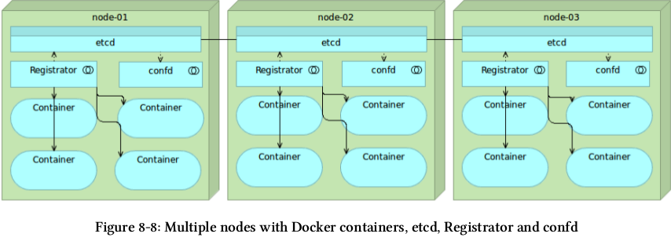

Devops Toolkit 2.0
##################

.. sidebar:: Meta

    :Optimization: Fine
    :Last Review: Never
    :Importance: High
    :Updated: |today|

.. contents::
    :Depth: 5

...............................................................................

System Architecture
*******************

Monolithic application was divided into presentation layer, business layer,
data access layer which is relatively good idea for small projects.
As application grows this architecture becomes unmanageable as even simple
feature might require lots of code because of layers.

Service-Oriented Architecture (SOA)
===================================

Four main concepts:

  #. Boundaries are explicit
  #. Services are autonomous
  #. Service share schema and contract but not class
  #. Service compatibility is based on policy

Microservices
=============

Package service date (decentralize) withing container is usually a better
design rather than using centralized database.

Remote process call with microservices introduce more overhead. Consider
splitting application by in a way to keep it organized and reduced remote
calls.

.. image:: images/micro_shared_db.png

On refactoring legacy systems to microservices, database is the most sensible
and high risk park. There is one approach when we have shared database but
schema/table is accessible from single container only, if other container needs
access, it uses API from responsible container.

With back-end being split into microservices and front-end being monolithic,
services we are building do not truly adhere to the idea that each should
provide a full functionality.

Docker
******

Use COPY unless you need additional features that ADD provides.

.. sourcecode:: sh

  DOCKER_OPTS="$DOCKER_OPTS --insecure-registry 10.100.198.200:5000
  -H tcp://0.0.0.0:2375 -H unix:///var/run/docker.sock

.. sourcecode:: sh

  PORT=$(docker inspect  --format='{{(index (index .NetworkSettings.Ports
  "8080/tcp") 0).HostPort}}' vagrant_app_1)

.. sourcecode:: sh

  # Use remote docker daemon
  export DOCKER_HOST=tcp://prod:2375
  docker ps

docker-compose
**************

Use ``extends`` to override targets and avoid duplications.

Service Discovery
*****************

etcd
====

.. sourcecode:: sh

  # Usage example

  etcdctl set myService/ip "1.2.3.4"
  etcdctl ls myService
  etcdctl rm myService/port

  curl http://localhost:2379/v2/keys/myService/newPort \
  -X PUT \
  -d value="4321" | jq '.'

  curl http://localhost:2379/v2/keys/myService/newPort \
  | jq '.'

  curl http://localhost:2379/v2/keys/ | jq '.'

.. sourcecode:: sh

  # Cluster example

  NODE_NAME=serv-disc-0$NODE_NUMBER
  NODE_IP=10.100.197.20$NODE_NUMBER
  NODE_01_ADDRESS=http://10.100.197.201:2380
  NODE_01_NAME=serv-disc-01
  NODE_01="$NODE_01_NAME=$NODE_01_ADDRESS"
  NODE_02_ADDRESS=http://10.100.197.202:2380
  NODE_02_NAME=serv-disc-02
  NODE_01="$NODE_02_NAME=$NODE_02_ADDRESS"
  NODE_03_ADDRESS=http://10.100.197.203:2380
  NODE_03_NAME=serv-disc-03
  NODE_01="$NODE_03_NAME=$NODE_03_ADDRESS"
  CLUSTER_TOKEN=serv-disc-cluster

  etcd -name serv-disc-1 \
  -initial-advertise-peer-urls http://$NODE_IP:2380 \
  -listen-peer-urls http://$NODE_IP:2380 \
  -listen-client-urls \
  http://$NODE_IP:2379,http://127.0.0.1:2379 \
  -advertise-client-urls http://$NODE_IP:2379 \
  -initial-cluster-token $CLUSTER_TOKEN \
  -initial-cluster \
  $NODE_01,$NODE_02,$NODE_03 \
  -initial-cluster-state new

registrator
-----------

Detects container run/termination and updates service discovery. Supports etcd,
Consul, SkyDNS.

.. sourcecode:: sh

  docker run -d --name registrator \
    -v /var/run/docker.sock:/tmp/docker.sock \
    -h serv-disc-01 \
    gliderlabs/registrator \
    -ip 10.100.194.201 etcd://10.100.194.201:2379

  # Set friendly service name for registrator per container
  docker run -d --name nginx \
    --env SERVICE_NAME=nginx \
    --env SERVICE_ID=nginx \
    -p 1234:80 \
    nginx

confd
-----

Build application configuration file from template and service discovery
key/values.

Daemon polls service discovery and updates config files.

.. sourcecode:: sh

   # One time
   confd -onetime -backend etcd -node 10.100.197.202:2379

Sample config stanza::

  # /etc/confd/conf.d/example.toml
  [template]
  src = "nginx.conf.tmpl"
  dest = "/tmp/nginx.conf"
  keys = [
     "/nginx-80/nginx"
  ]

Sample template file. Uses Golang text templates::

  # /etc/confd/templates/example.conf.toml
  The address is {{getv "/nginx-80/nginx"}}

Concul
======

book-ms
*******

Vagrant
=======

:dev: 10.100.199.200

Dockerfile
==========

Runs compiled JAR application.

docker-compose-dev.yml
======================

.. option:: app

  Run application linked to MongoDB container.

.. option:: tests

  Run all pre-deployment test and compile to JAR.

.. option:: testsLocal

  Start db, run functional, unit, front tests and compile to JAR.

.. option:: feTestsLocal

  Run whole application and watch for changes to run tests.

ms-lifecycle
************

Vagrant
=======

:cd: 10.100.198.200
:prod: 10.100.198.201

Pipeline
========

1. Check out the code
2. Run pre-deployment tests
3. Compile and/or package the code
4. Build the container
#. Push the container to the registry
#. Deploy the container to the production server
#. Integrate the container
#. Run post-integration tests
#. Push the tests container to the registry

1. ``git clone https://github.com/vfarcic/books-ms.git``
2. Tests that do not require the service to be deployed.

   .. sourcecode:: sh

     docker build -f Dockerfile.test -t 10.100.198.200:5000/books-ms-tests .
     docker-compose -f docker-compose-dev.yml run --rm tests

3. Generated after tests: ``ll target/scala-2.10/``
4. ``docker build -t 10.100.198.200:5000/books-ms .``
5. ``docker push 10.100.198.200:5000/books-ms``

