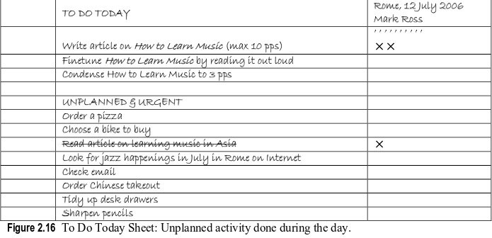

The Pomodoro Technique
######################

.. sidebar:: Meta

    :Optimization: Fine
    :Last Review: Never
    :Importance: Low
    :Updated: |today|

.. contents::
    :Depth: 5

...............................................................................

Pomodoro
********

Each Pomodoro consists of 25 Min. When it rings have a 3-5 Min
break, disconnect from task, walk. Don't split Pomodoro in half. If you get
interrupted you should start that Pomodoro from the beginning. Rule: Once a
Pomodoro Begins, It Has to Ring.
If we have internal interruption coming on, put an apostrophe on the sheet and
write the task in "Unplanned & Urgent" list, resume to the Pomodoro.

Flow
****

At the beginning of the day write down on paper tasks you want to accomplish
and sort them by priority.

#. Start Pomodoro for the task.
#. After 4 Pomodoro, have a 15-30 Min break.
#. Once task is finished and you have left some time, spend the rest time to
   review, note, make small improvements. If it was done during first 5 Min,
   this Pomodoro doesn't count.
