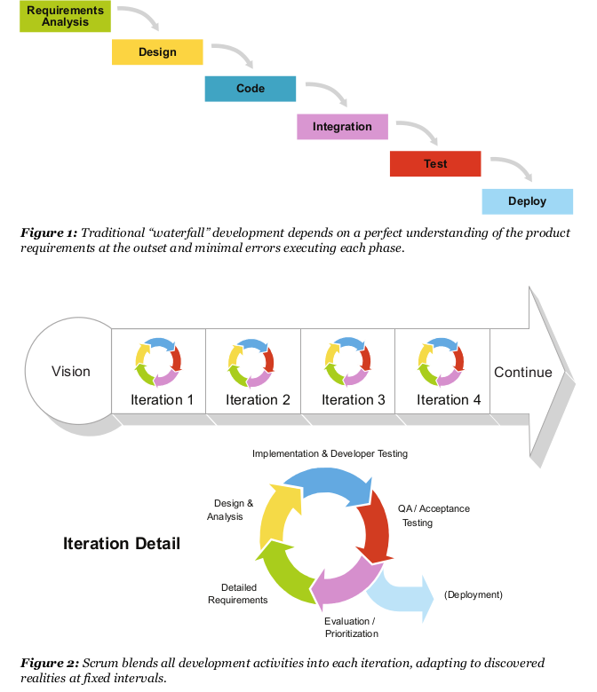
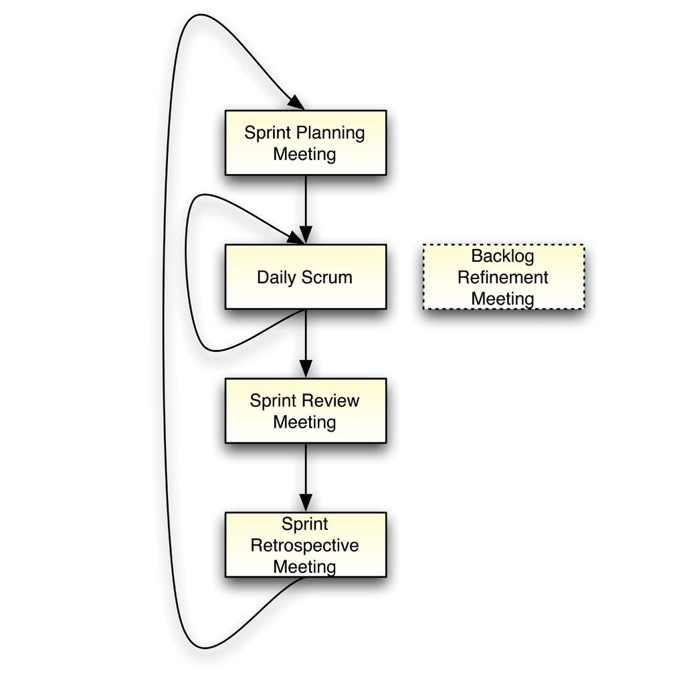

Scrum
#####

.. sidebar:: Meta

  :Optimization: Fine
  :Last Review: Never
  :Importance: Medium
  :Updated: |today|

.. contents::
  :Depth: 5

...............................................................................

Roles
*****

.. glossary::

  *Product Owner* (PO)
    * Single person maximizing ROI (Return On Investment)
    * Take care of *Product Backlog*
    * Decides ship new iteration or not etc

  *Dev Team* (DT)
    * *Cross-Functional* (have desired skills to reach the goals, NO external
      deps)
    * Self-managed, self-organized
    * Autonomy how to reach commitments

  *ScrumMaster* (SM)
    * Keep scrum *Artifacts* visible
    * No management authority over the team
    * Enforeces timeboxes and Scrum process

Meetings
********

Sprint Planning Meeting
=======================

* 8 hour timebox.
* DT and PO negotiate which Items they can work during next *Sprint*.
* PO determines which items are most important.
* DT chooses amount of items they can implement without technical debt.
* Items are pulled from *Product Backlog* to *Sprint Backlog*.
* Until team learns to finish what they say, we reduce the amount of
  functionality they commits.

Daily Scrum
===========

* 15 min timebox.
* Devs say what he did yesterday, what he will to today and if there are any
  impediments.

Sprint Review Meeting
=====================

* 4 hour timebox.
* After Sprint execution.
* Includes live demonstration (not a report) of finished items
* PO declares which items are "DONE" and which should be returns to the
  *Product Backlog* and prioritized.
* "DONE" should be shippable (tested etc).
* Good meeting for external stakeholders(even end user) to attend.

Sprint Retrospective Meeting
============================

* Team inspects their behavior.
* Should be transparent team and feel psychological safety.

Product Backlog Refinement Meeting
==================================

* Most PBI (Items) need refinement cos they are large or vague.

Boards
*******

Product Backlog
===============

* Ranked List
* Any stakeholder can add item
* Epic
    + *User Story* form or like flowchart
    + *Epic* items are sliced into small doable task
    + Useful to prioritize task within *Epic* PBI and deliver them at first

Sprint Backlog
==============

* Committed PBI-s between PO and DT
* Task will be added during the Sprint execution
* Committed Backlog Items / Tasks Not Started / Task In Progress / Tasks
  Completed

* While devs work on a sprint (Optional)
    + Sprint Task List
    + Sprint Burn-down Chart (how many items left)
    + Impediments List
       + *Organizational Impediment* - should be outside dev control

Artifacts
*********

* Product Backlog Item (PBI)
    * Specifies *what* (for e.g: Enable SSL).
    * Product wide definition of "DONE" to avoid technical debts.
    * Effort is estimated by the team.

* Sprint Task
    * How to achieve PBI.
    * Specifies one day or less of work.
    * Remaining effort is re-estimated daily.

* Sprint Burn-down Chart
    * Total remaining task *hours*
    * Re-estimated daily

* Scaling
    * Not easy
    * Best approach creating *Feature Teams* who operate at all layers

* When Scrum
    * How well are requirements understood, if it depends of knowledge created
      while working
    * Uncertain requirements with unpredictable technology
    * Not intended for repeatable types of production

* Sprint
    * Fixed-length iteration
    * 2 weeks to 30 days max
    * Tested and shippable

.. seealso::
    * http://scrumreferencecard.com/scrum-reference-card/
